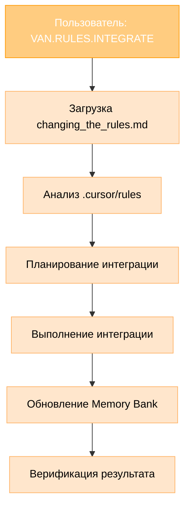

# РУКОВОДСТВО ПО ИНТЕГРАЦИИ ПРАВИЛ ЧЕРЕЗ VAN РЕЖИМ

> **TL;DR:** Как использовать расширенный VAN режим для интеграции правил Memory Bank с ограничением в 5 кастомных режимов.

## 🎯 РЕШЕНИЕ ПРОБЛЕМЫ

### Проблема:
- Cursor IDE ограничивает количество кастомных режимов до 5
- Нужно интегрировать функциональность управления правилами
- Уже есть 5 режимов: VAN, PLAN, CREATIVE, IMPLEMENT, QA

### Решение:
Расширить существующий VAN режим подрежимами через точечную нотацию:
- `VAN.RULES` - управление правилами
- `VAN.SYSTEM` - системное администрирование

## 🔧 РЕАЛИЗОВАННАЯ ИНТЕГРАЦИЯ

### Файлы интеграции:
1. **`custom_modes/van_instructions.md`** - обновлен с подрежимами
2. **`custom_modes/van_enhanced.md`** - документация подхода
3. **`custom_modes/rules_instructions.md`** - детальные инструкции
4. **`custom_modes/rules_integration_analysis.md`** - анализ интеграции
5. **`rules/changing_the_rules.md`** - руководство по изменению правил

### Команды VAN.RULES:
```bash
VAN.RULES                # Активация подрежима
VAN.RULES.INTEGRATE      # Интеграция .cursor правил
VAN.RULES.MODIFY         # Модификация правил
VAN.RULES.CREATE         # Создание новых правил
VAN.RULES.VALIDATE       # Валидация правил
VAN.RULES.STATUS         # Статус интеграции
```

### Команды VAN.SYSTEM:
```bash
VAN.SYSTEM               # Активация подрежима
VAN.SYSTEM.OPTIMIZE      # Оптимизация системы
VAN.SYSTEM.BACKUP        # Резервное копирование
VAN.SYSTEM.RESTORE       # Восстановление
VAN.SYSTEM.HEALTH        # Проверка здоровья
```

## 🚀 БЫСТРЫЙ СТАРТ

### Шаг 1: Замена van_instructions.md
```bash
# Заменить содержимое custom_modes/van_instructions.md
# на обновленную версию с подрежимами
```

### Шаг 2: Тестирование интеграции
```bash
# Команда для проверки
VAN.RULES.STATUS

# Ожидаемый ответ
OK VAN.RULES
Activating VAN.RULES status submode...
Checking rules integration status...
```

### Шаг 3: Интеграция правил
```bash
# Команда для интеграции
VAN.RULES.INTEGRATE

# Процесс:
# 1. Читает changing_the_rules.md
# 2. Анализирует .cursor/rules
# 3. Планирует интеграцию
# 4. Выполняет интеграцию
# 5. Обновляет Memory Bank
```

## 📊 ПРЕИМУЩЕСТВА РЕШЕНИЯ

### ✅ Соблюдение ограничений:
- Остается в рамках 5 кастомных режимов
- Не нарушает существующую архитектуру
- Сохраняет совместимость

### ✅ Полная функциональность:
- Управление правилами через VAN.RULES
- Системное администрирование через VAN.SYSTEM
- Использование созданного руководства
- Интеграция с Memory Bank

### ✅ Удобство использования:
- Интуитивные команды
- Четкое разделение функций
- Логическая структура

## 🔄 ПРОЦЕСС ИНТЕГРАЦИИ



## 📋 ЧЕКЛИСТ ВНЕДРЕНИЯ

### Подготовка:
- [ ] Обновить `custom_modes/van_instructions.md`
- [ ] Проверить наличие `rules/changing_the_rules.md`
- [ ] Убедиться в доступности всех созданных файлов

### Тестирование:
- [ ] Протестировать `VAN.RULES.STATUS`
- [ ] Протестировать `VAN.SYSTEM.HEALTH`
- [ ] Проверить стандартный `VAN` режим

### Интеграция:
- [ ] Выполнить `VAN.RULES.VALIDATE`
- [ ] Выполнить `VAN.RULES.INTEGRATE`
- [ ] Проверить результаты интеграции

## 🎉 РЕЗУЛЬТАТ

Получаем мощную систему управления правилами, полностью интегрированную в существующую архитектуру Memory Bank без нарушения ограничений Cursor IDE.

### Возможности:
- ✅ Полное управление правилами
- ✅ Системное администрирование
- ✅ Интеграция с Memory Bank
- ✅ Использование Cursor workaround
- ✅ Сохранение всех 5 основных режимов
- ✅ Расширяемость для будущих функций