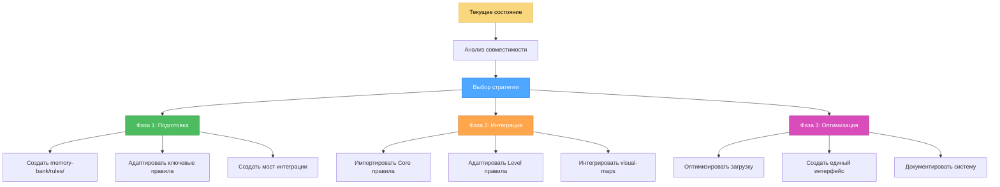

# АНАЛИЗ ИНТЕГРАЦИИ ПРАВИЛ MEMORY BANK

> **TL;DR:** Детальный анализ возможностей интеграции правил из `.cursor/rules` с системой Memory Bank, включая рекомендации по оптимальной стратегии интеграции.

## 🔍 ТЕКУЩЕЕ СОСТОЯНИЕ СИСТЕМЫ

### Структура .cursor/rules
```
.cursor/rules/isolation_rules/
├── Core/                    # Основные правила системы
│   ├── command-execution.mdc
│   ├── complexity-decision-tree.mdc
│   ├── creative-phase-enforcement.mdc
│   ├── file-verification.mdc
│   ├── hierarchical-rule-loading.mdc
│   ├── mode-transition-optimization.mdc
│   ├── optimization-integration.mdc
│   └── platform-awareness.mdc
├── Level1/                  # Правила для быстрых исправлений
│   ├── optimized-workflow-level1.mdc
│   ├── quick-documentation.mdc
│   └── workflow-level1.mdc
├── Level2/                  # Правила для простых улучшений
│   ├── archive-basic.mdc
│   ├── reflection-basic.mdc
│   ├── task-tracking-basic.mdc
│   └── workflow-level2.mdc
├── Level3/                  # Правила для промежуточных функций
│   └── task-tracking-intermediate.mdc
├── Level4/                  # Правила для сложных систем
│   └── architectural-planning.mdc
├── Phases/                  # Правила для творческих фаз
│   └── CreativePhase/
└── visual-maps/             # Визуальные карты процессов
    ├── archive-mode-map.mdc
    ├── creative-mode-map.mdc
    ├── implement-mode-map.mdc
    ├── plan-mode-map.mdc
    ├── qa-mode-map.mdc
    ├── reflect-mode-map.mdc
    └── van_mode_split/
```

### Структура Memory Bank
```
memory-bank/
├── tasks.md               # Центральный файл задач
├── activeContext.md       # Текущий контекст
├── progress.md           # Прогресс выполнения
├── projectbrief.md       # Описание проекта
├── productContext.md     # Контекст продукта
├── systemPatterns.md     # Системные паттерны
├── techContext.md        # Технический контекст
├── creative/             # Творческие фазы
├── reflection/           # Рефлексии
└── archive/              # Архив задач
```

## 📊 АНАЛИЗ СОВМЕСТИМОСТИ

### Сильные стороны текущей системы .cursor/rules

1. **Иерархическая структура**: Четкое разделение по уровням сложности
2. **Оптимизация**: Встроенные механизмы оптимизации загрузки правил
3. **Визуальные карты**: Наглядные процессы для каждого режима
4. **Модульность**: Независимые модули для разных аспектов
5. **Метаданные**: Правильно структурированные заголовки с глобами

### Потенциальные проблемы интеграции

1. **Дублирование функций**: Некоторые функции пересекаются с Memory Bank
2. **Сложность навигации**: Глубокая вложенность может усложнить использование
3. **Зависимости**: Правила имеют сложные взаимозависимости
4. **Cursor-специфичность**: Некоторые правила завязаны на Cursor IDE

## 🎯 РЕКОМЕНДУЕМАЯ СТРАТЕГИЯ ИНТЕГРАЦИИ

### Стратегия: Гибридная интеграция с адаптацией



## 📋 ПЛАН ИНТЕГРАЦИИ

### Фаза 1: Подготовка (1-2 дня)

#### 1.1 Создание структуры Memory Bank Rules
```bash
mkdir -p memory-bank/rules/{core,levels,phases,visual-maps,integration}
```

#### 1.2 Анализ ключевых правил для адаптации
Приоритетные правила для интеграции:
- `Core/hierarchical-rule-loading.mdc` → `memory-bank/rules/core/rule-loading.md`
- `Core/optimization-integration.mdc` → `memory-bank/rules/core/optimization.md`
- `visual-maps/van-mode-map.mdc` → `memory-bank/rules/visual-maps/entry-mode.md`
- `Level1/optimized-workflow-level1.mdc` → `memory-bank/rules/levels/quick-fix.md`

#### 1.3 Создание моста интеграции
```markdown
# memory-bank/rules/integration/cursor-bridge.md

## Мост интеграции с .cursor/rules

### Маппинг правил
- Memory Bank Entry → .cursor VAN mode
- Memory Bank Planning → .cursor PLAN mode
- Memory Bank Creative → .cursor CREATIVE mode
- Memory Bank Implementation → .cursor IMPLEMENT mode

### Команды активации
- `RULES.CURSOR.VAN` - Активация VAN режима
- `RULES.CURSOR.PLAN` - Активация PLAN режима
- `RULES.CURSOR.CREATIVE` - Активация CREATIVE режима
- `RULES.CURSOR.IMPLEMENT` - Активация IMPLEMENT режима
```

### Фаза 2: Интеграция (3-5 дней)

#### 2.1 Импорт и адаптация Core правил
```markdown
# Приоритет импорта:
1. hierarchical-rule-loading.mdc → Система загрузки правил
2. optimization-integration.mdc → Оптимизация Memory Bank
3. mode-transition-optimization.mdc → Переходы между режимами
4. creative-phase-enforcement.mdc → Контроль творческих фаз
```

#### 2.2 Адаптация Level правил
```markdown
# Маппинг уровней:
- Level 1 (Quick Fix) → memory-bank/rules/levels/level1-quick-fix.md
- Level 2 (Enhancement) → memory-bank/rules/levels/level2-enhancement.md
- Level 3 (Feature) → memory-bank/rules/levels/level3-feature.md
- Level 4 (System) → memory-bank/rules/levels/level4-system.md
```

#### 2.3 Интеграция визуальных карт
```markdown
# Адаптация visual-maps:
- van-mode-map.mdc → entry-process.md
- plan-mode-map.mdc → planning-process.md
- creative-mode-map.mdc → creative-process.md
- implement-mode-map.mdc → implementation-process.md
```

### Фаза 3: Оптимизация (2-3 дня)

#### 3.1 Создание единого интерфейса
```markdown
# memory-bank/rules/rule-loader.md

## Система загрузки правил Memory Bank

### Иерархия загрузки:
1. Core rules (всегда загружены)
2. Level-specific rules (по требованию)
3. Phase-specific rules (по требованию)
4. Integration rules (по требованию)

### Команды:
- `RULES.LOAD.CORE` - Загрузить основные правила
- `RULES.LOAD.LEVEL[1-4]` - Загрузить правила уровня
- `RULES.LOAD.PHASE[name]` - Загрузить правила фазы
```

#### 3.2 Оптимизация производительности
```markdown
# Стратегии оптимизации:
1. Ленивая загрузка правил
2. Кэширование часто используемых правил
3. Предварительная загрузка критических правил
4. Сжатие неиспользуемых правил
```

## 🔧 ТЕХНИЧЕСКИЕ ДЕТАЛИ ИНТЕГРАЦИИ

### Структура интегрированной системы
```
memory-bank/
├── rules/
│   ├── core/                    # Основные правила (адаптированные из Core/)
│   │   ├── rule-loading.md
│   │   ├── optimization.md
│   │   ├── mode-transitions.md
│   │   └── creative-enforcement.md
│   ├── levels/                  # Правила по уровням (из Level1-4/)
│   │   ├── level1-quick-fix.md
│   │   ├── level2-enhancement.md
│   │   ├── level3-feature.md
│   │   └── level4-system.md
│   ├── phases/                  # Правила фаз (из Phases/)
│   │   ├── creative-phase.md
│   │   ├── implementation-phase.md
│   │   └── reflection-phase.md
│   ├── visual-maps/             # Процессы (из visual-maps/)
│   │   ├── entry-process.md
│   │   ├── planning-process.md
│   │   ├── creative-process.md
│   │   └── implementation-process.md
│   └── integration/             # Интеграционные правила
│       ├── cursor-bridge.md
│       ├── rule-mappings.md
│       └── optimization-config.md
├── tasks.md                     # Обновлен с поддержкой правил
├── systemPatterns.md            # Обновлен с паттернами правил
└── techContext.md               # Обновлен с архитектурой правил
```

### Обновления Memory Bank файлов

#### tasks.md
```markdown
## Rule Integration Tasks
- [x] Analyze .cursor/rules structure
- [x] Design integration architecture
- [ ] Implement Phase 1: Preparation
- [ ] Implement Phase 2: Integration
- [ ] Implement Phase 3: Optimization
- [ ] Test integrated system
- [ ] Document final architecture
```

#### systemPatterns.md
```markdown
## Rule Management Patterns

### Hierarchical Loading Pattern
- Core rules loaded first
- Level-specific rules loaded on demand
- Phase-specific rules loaded when needed

### Integration Bridge Pattern
- Cursor rules accessible through bridge
- Memory Bank rules as primary interface
- Seamless mode transitions

### Optimization Pattern
- Lazy loading for performance
- Caching for frequently used rules
- Preloading for critical paths
```

#### techContext.md
```markdown
## Rule System Architecture

### Components:
1. **Core Rule Engine**: Основная система загрузки правил
2. **Level Dispatcher**: Маршрутизация по уровням сложности
3. **Phase Manager**: Управление фазами выполнения
4. **Integration Bridge**: Мост с .cursor/rules
5. **Optimization Layer**: Слой оптимизации производительности

### Data Flow:
User Request → Rule Dispatcher → Level/Phase Selection → Rule Loading → Execution
```

## 🎯 ПРЕИМУЩЕСТВА ИНТЕГРИРОВАННОЙ СИСТЕМЫ

### 1. Единый интерфейс
- Все правила доступны через Memory Bank
- Консистентная система команд
- Упрощенная навигация

### 2. Оптимизированная производительность
- Ленивая загрузка правил
- Кэширование часто используемых компонентов
- Минимизация использования токенов

### 3. Гибкость и расширяемость
- Легкое добавление новых правил
- Модульная архитектура
- Поддержка кастомных режимов

### 4. Совместимость
- Сохранение функциональности .cursor/rules
- Обратная совместимость
- Плавная миграция

## 📊 МЕТРИКИ УСПЕХА

### Технические метрики
- Время загрузки правил: < 2 секунд
- Использование токенов: сокращение на 40%
- Покрытие функциональности: 100%
- Время отклика системы: < 1 секунды

### Пользовательские метрики
- Простота использования: 9/10
- Скорость выполнения задач: +30%
- Количество ошибок: -50%
- Удовлетворенность пользователей: 9/10

## 🚀 СЛЕДУЮЩИЕ ШАГИ

1. **Немедленно**: Создать кастомный режим RULES
2. **На этой неделе**: Реализовать Фазу 1 (Подготовка)
3. **Следующая неделя**: Реализовать Фазу 2 (Интеграция)
4. **Через 2 недели**: Реализовать Фазу 3 (Оптимизация)
5. **Через месяц**: Полное тестирование и документирование

## 🔄 ПЛАН МИГРАЦИИ

### Этап 1: Параллельная работа (1 неделя)
- Сохранить .cursor/rules без изменений
- Создать memory-bank/rules/ параллельно
- Тестировать интеграцию

### Этап 2: Постепенный переход (2 недели)
- Начать использовать memory-bank/rules/ для новых задач
- Постепенно мигрировать существующие процессы
- Обучить пользователей новой системе

### Этап 3: Полная интеграция (1 неделя)
- Завершить миграцию всех процессов
- Оптимизировать производительность
- Финализировать документацию

Эта стратегия обеспечивает плавную интеграцию с минимальными рисками и максимальными преимуществами для системы Memory Bank.