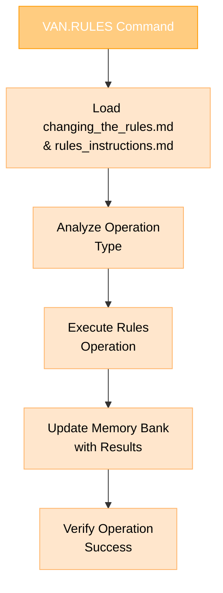
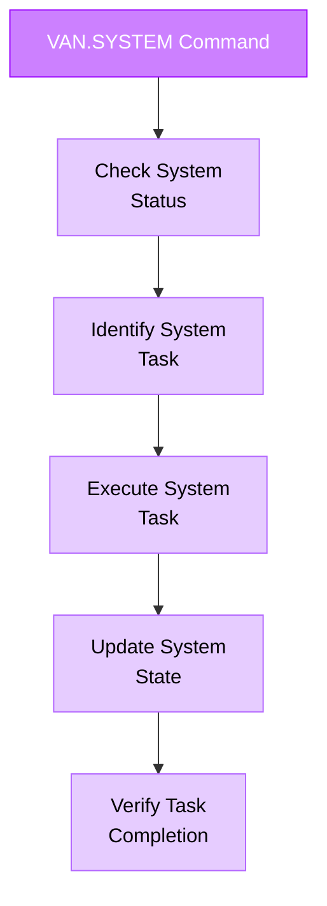

# ENHANCED VAN MODE - SYSTEM ADMINISTRATION & RULES MANAGEMENT

> **TL;DR:** Расширенный VAN режим с подрежимами VAN.RULES и VAN.SYSTEM для управления правилами и системным администрированием.

## 🎯 РЕШЕНИЕ ПРОБЛЕМЫ ОГРАНИЧЕНИЯ 5 РЕЖИМОВ

Вместо создания отдельного режима RULES, интегрируем функциональность в существующий VAN режим через подрежимы:

### Структура команд:
- **`VAN`** - Стандартный VAN режим
- **`VAN.RULES`** - Управление правилами
- **`VAN.SYSTEM`** - Системное администрирование

## 🔧 VAN.RULES ПОДРЕЖИМ

### Команды VAN.RULES:
```
VAN.RULES.INTEGRATE  - Интеграция .cursor правил с Memory Bank
VAN.RULES.MODIFY     - Модификация существующих правил
VAN.RULES.CREATE     - Создание новых правил
VAN.RULES.VALIDATE   - Валидация всех правил
VAN.RULES.STATUS     - Статус интеграции правил
```

### Процесс VAN.RULES:


## ⚙️ VAN.SYSTEM ПОДРЕЖИМ

### Команды VAN.SYSTEM:
```
VAN.SYSTEM.OPTIMIZE  - Оптимизация Memory Bank
VAN.SYSTEM.BACKUP    - Резервное копирование
VAN.SYSTEM.RESTORE   - Восстановление из резервной копии
VAN.SYSTEM.HEALTH    - Проверка состояния системы
```

### Процесс VAN.SYSTEM:


## 📋 ИНТЕГРАЦИЯ С СУЩЕСТВУЮЩИМ VAN

### Обновленная логика распознавания команд:
```javascript
// Псевдокод логики
if (command.startsWith("VAN.RULES")) {
    activateRulesSubmode(command);
} else if (command.startsWith("VAN.SYSTEM")) {
    activateSystemSubmode(command);
} else if (command === "VAN") {
    activateStandardVan();
} else {
    // Другие режимы (PLAN, CREATIVE, IMPLEMENT, QA)
}
```

## 🔄 ПРИМЕРЫ ИСПОЛЬЗОВАНИЯ

### Пример 1: Интеграция правил
```
User: VAN.RULES.INTEGRATE
Assistant: OK VAN.RULES

🔗 Активирую подрежим интеграции правил...
📚 Читаю changing_the_rules.md...
🔍 Анализирую структуру .cursor/rules...
⚡ Планирую стратегию интеграции...
[Выполняет процесс интеграции]
```

### Пример 2: Валидация правил
```
User: VAN.RULES.VALIDATE
Assistant: OK VAN.RULES

✅ Активирую подрежим валидации правил...
🔍 Сканирую все .mdc файлы...
📊 Проверяю расширения файлов, регистр, ссылки...
📋 Генерирую отчет валидации...
[Выполняет процесс валидации]
```

### Пример 3: Проверка здоровья системы
```
User: VAN.SYSTEM.HEALTH
Assistant: OK VAN.SYSTEM

🏥 Активирую подрежим проверки здоровья системы...
🔍 Проверяю целостность Memory Bank...
📁 Верифицирую структуру файлов...
⚡ Анализирую производительность системы...
[Выполняет проверку здоровья]
```

## 🎯 ПРЕИМУЩЕСТВА ЭТОГО ПОДХОДА

### ✅ Соблюдение ограничений:
- Остается в рамках 5 кастомных режимов
- Расширяет существующий VAN режим
- Сохраняет логическую структуру

### ✅ Функциональность:
- Полная интеграция управления правилами
- Системное администрирование
- Использование созданного руководства `changing_the_rules.md`

### ✅ Удобство использования:
- Интуитивные команды с точечной нотацией
- Четкое разделение функций
- Совместимость с существующими процессами

## 🔧 ПЛАН РЕАЛИЗАЦИИ

### Шаг 1: Обновить van_instructions.md
Добавить логику распознавания подрежимов и их обработку.

### Шаг 2: Интегрировать созданные материалы
- `rules/changing_the_rules.md` - как руководство для VAN.RULES
- `custom_modes/rules_instructions.md` - как детальные инструкции
- `custom_modes/rules_integration_analysis.md` - как справочник

### Шаг 3: Тестирование
Проверить работу всех подрежимов и их интеграцию с Memory Bank.

## 📊 РЕЗУЛЬТАТ

Получаем мощную систему управления правилами, интегрированную в существующую архитектуру без нарушения ограничений Cursor IDE на количество кастомных режимов.

Этот подход позволяет:
- ✅ Управлять правилами через VAN.RULES
- ✅ Администрировать систему через VAN.SYSTEM
- ✅ Сохранить все 5 основных режимов
- ✅ Использовать созданное руководство по изменению правил
- ✅ Обеспечить полную функциональность без компромиссов