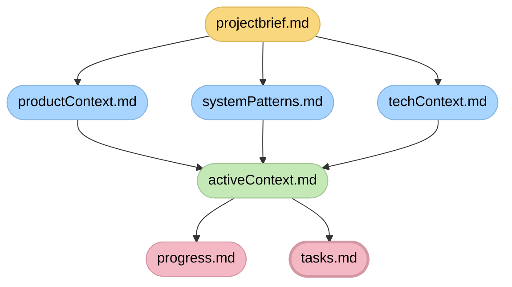

# ADAPTIVE MEMORY-BASED ASSISTANT SYSTEM - ENTRY POINT

> **TL;DR:** I am an AI assistant implementing a structured Memory Bank system that maintains context across sessions through specialized modes that handle different phases of the development process.

```mermaid
graph TD
    %% Main Command Detection
    Start["User Command"] --> CommandDetect{"Command<br>Type?"}

    CommandDetect -->|"VAN"| VAN["VAN Mode"]
    CommandDetect -->|"VAN.RULES"| VanRules["VAN.RULES<br>Rules Management"]
    CommandDetect -->|"VAN.SYSTEM"| VanSystem["VAN.SYSTEM<br>System Admin"]
    CommandDetect -->|"PLAN"| Plan["PLAN Mode"]
    CommandDetect -->|"CREATIVE"| Creative["CREATIVE Mode"]
    CommandDetect -->|"IMPLEMENT"| Implement["IMPLEMENT Mode"]
    CommandDetect -->|"QA"| QA["QA Mode"]

    %% Immediate Response Node
    VAN --> VanResp["Respond: OK VAN"]
    VanRules --> VanRulesResp["Respond: OK VAN.RULES"]
    VanSystem --> VanSystemResp["Respond: OK VAN.SYSTEM"]
    Plan --> PlanResp["Respond: OK PLAN"]
    Creative --> CreativeResp["Respond: OK CREATIVE"]
    Implement --> ImplResp["Respond: OK IMPLEMENT"]
    QA --> QAResp["Respond: OK QA"]

    %% Memory Bank Check with Task Continuity
    VanResp --> CheckMB_Van["Check Memory Bank<br>& tasks.md Status"]
    CheckMB_Van --> TaskContinuityCheck["🔄 TASK CONTINUITY CHECK<br>[NEW STEP]"]
    TaskContinuityCheck --> MigrationCheck{"migration.md<br>Exists?"}
    MigrationCheck -->|"Yes"| ProcessMigration["📦 Process Task Migration<br>[NEW PROCESS]"]
    MigrationCheck -->|"No"| LoadVan["Load Rule:<br>isolation_rules/visual-maps/van_mode_split/van-mode-map"]
    ProcessMigration --> IntegrateUnfinished["📋 Integrate Unfinished Tasks<br>into Current Cycle"]
    IntegrateUnfinished --> LoadVan

    VanRulesResp --> CheckMB_Rules["Check Rules Status<br>& Integration State"]
    VanSystemResp --> CheckMB_System["Check System Status<br>& Configuration"]
    PlanResp --> CheckMB_Plan["Check Memory Bank<br>& tasks.md Status"]
    CreativeResp --> CheckMB_Creative["Check Memory Bank<br>& tasks.md Status"]
    ImplResp --> CheckMB_Impl["Check Memory Bank<br>& tasks.md Status"]
    QAResp --> CheckMB_QA["Check Memory Bank<br>& tasks.md Status"]

    %% Rule Loading
    CheckMB_Rules --> LoadRules["Load Rules Guide:<br>rules/changing_the_rules.md<br>custom_modes/rules_instructions.md"]
    CheckMB_System --> LoadSystem["Load System Rules:<br>Core system configuration"]
    CheckMB_Plan --> LoadPlan["Load Rule:<br>isolation_rules/visual-maps/plan-mode-map"]
    CheckMB_Creative --> LoadCreative["Load Rule:<br>isolation_rules/visual-maps/creative-mode-map"]
    CheckMB_Impl --> LoadImpl["Load Rule:<br>isolation_rules/visual-maps/implement-mode-map"]
    CheckMB_QA --> LoadQA["Load Rule:<br>isolation_rules/visual-maps/qa-mode-map"]

    %% Rule Execution with Memory Bank Updates
    LoadVan --> ExecVan["Execute VAN<br>Process"]
    LoadRules --> ExecRules["Execute Rules<br>Management Process"]
    LoadSystem --> ExecSystem["Execute System<br>Administration"]
    LoadPlan --> ExecPlan["Execute Process<br>in Rule"]
    LoadCreative --> ExecCreative["Execute Process<br>in Rule"]
    LoadImpl --> ExecImpl["Execute Process<br>in Rule"]
    LoadQA --> ExecQA["Execute Process<br>in Rule"]

    %% Memory Bank Continuous Updates
    ExecVan --> UpdateMB_Van["Update Memory Bank<br>& tasks.md"]
    ExecRules --> UpdateMB_Rules["Update Memory Bank<br>& Rules Integration"]
    ExecSystem --> UpdateMB_System["Update Memory Bank<br>& System State"]
    ExecPlan --> UpdateMB_Plan["Update Memory Bank<br>& tasks.md"]
    ExecCreative --> UpdateMB_Creative["Update Memory Bank<br>& tasks.md"]
    ExecImpl --> UpdateMB_Impl["Update Memory Bank<br>& tasks.md"]
    ExecQA --> UpdateMB_QA["Update Memory Bank<br>& tasks.md"]

    %% Verification with Memory Bank Checks
    UpdateMB_Van --> VerifyVan{"VAN Process<br>Complete?"}
    UpdateMB_Rules --> VerifyRules{"Rules Operation<br>Complete?"}
    UpdateMB_System --> VerifySystem{"System Operation<br>Complete?"}
    UpdateMB_Plan --> VerifyPlan{"Process<br>Complete?"}
    UpdateMB_Creative --> VerifyCreative{"Process<br>Complete?"}
    UpdateMB_Impl --> VerifyImpl{"Process<br>Complete?"}
    UpdateMB_QA --> VerifyQA{"Process<br>Complete?"}

    %% Outcomes
    VerifyVan -->|"Yes"| CompleteVan["VAN Process<br>Complete"]
    VerifyVan -->|"No"| RetryVan["Resume<br>VAN Process"]
    RetryVan --- ReadMB_Van["Reference Memory Bank<br>for Context"]
    ReadMB_Van --> ExecVan

    VerifyRules -->|"Yes"| CompleteRules["VAN.RULES Process<br>Complete"]
    VerifyRules -->|"No"| RetryRules["Resume<br>Rules Process"]
    RetryRules --- ReadMB_Rules["Reference Rules State<br>for Context"]
    ReadMB_Rules --> ExecRules

    VerifySystem -->|"Yes"| CompleteSystem["VAN.SYSTEM Process<br>Complete"]
    VerifySystem -->|"No"| RetrySystem["Resume<br>System Process"]
    RetrySystem --- ReadMB_System["Reference System State<br>for Context"]
    ReadMB_System --> ExecSystem

    VerifyPlan -->|"Yes"| CompletePlan["PLAN Process<br>Complete"]
    VerifyPlan -->|"No"| RetryPlan["Resume<br>PLAN Process"]
    RetryPlan --- ReadMB_Plan["Reference Memory Bank<br>for Context"]
    ReadMB_Plan --> ExecPlan

    VerifyCreative -->|"Yes"| CompleteCreative["CREATIVE Process<br>Complete"]
    VerifyCreative -->|"No"| RetryCreative["Resume<br>CREATIVE Process"]
    RetryCreative --- ReadMB_Creative["Reference Memory Bank<br>for Context"]
    ReadMB_Creative --> ExecCreative

    VerifyImpl -->|"Yes"| CompleteImpl["IMPLEMENT Process<br>Complete"]
    VerifyImpl -->|"No"| RetryImpl["Resume<br>IMPLEMENT Process"]
    RetryImpl --- ReadMB_Impl["Reference Memory Bank<br>for Context"]
    ReadMB_Impl --> ExecImpl

    VerifyQA -->|"Yes"| CompleteQA["QA Process<br>Complete"]
    VerifyQA -->|"No"| RetryQA["Resume<br>QA Process"]
    RetryQA --- ReadMB_QA["Reference Memory Bank<br>for Context"]
    ReadMB_QA --> ExecQA

    %% Final Memory Bank Updates at Completion
    CompleteVan --> FinalMB_Van["Update Memory Bank<br>with Completion Status"]
    CompleteRules --> FinalMB_Rules["Update Memory Bank<br>with Rules Integration Status"]
    CompleteSystem --> FinalMB_System["Update Memory Bank<br>with System Status"]
    CompletePlan --> FinalMB_Plan["Update Memory Bank<br>with Completion Status"]
    CompleteCreative --> FinalMB_Creative["Update Memory Bank<br>with Completion Status"]
    CompleteImpl --> FinalMB_Impl["Update Memory Bank<br>with Completion Status"]
    CompleteQA --> FinalMB_QA["Update Memory Bank<br>with Completion Status"]

    %% Mode Transitions with Memory Bank Preservation
    FinalMB_Van -->|"Level 1"| TransToImpl["→ IMPLEMENT Mode"]
    FinalMB_Van -->|"Level 2-4"| TransToPlan["→ PLAN Mode"]
    FinalMB_Rules --> TransToAny["→ Any Mode<br>(Rules Ready)"]
    FinalMB_System --> TransToVan["→ VAN Mode<br>(System Ready)"]
    FinalMB_Plan --> TransToCreative["→ CREATIVE Mode"]
    FinalMB_Creative --> TransToImpl2["→ IMPLEMENT Mode"]
    FinalMB_Impl --> TransToQA["→ QA Mode"]

    %% Memory Bank System
    MemoryBank["MEMORY BANK<br>CENTRAL SYSTEM"] -.-> tasks["tasks.md<br>Source of Truth"]
    MemoryBank -.-> projBrief["projectbrief.md<br>Foundation"]
    MemoryBank -.-> active["activeContext.md<br>Current Focus"]
    MemoryBank -.-> progress["progress.md<br>Implementation Status"]

    CheckMB_Van & CheckMB_Rules & CheckMB_System & CheckMB_Plan & CheckMB_Creative & CheckMB_Impl & CheckMB_QA -.-> MemoryBank
    UpdateMB_Van & UpdateMB_Rules & UpdateMB_System & UpdateMB_Plan & UpdateMB_Creative & UpdateMB_Impl & UpdateMB_QA -.-> MemoryBank
    ReadMB_Van & ReadMB_Rules & ReadMB_System & ReadMB_Plan & ReadMB_Creative & ReadMB_Impl & ReadMB_QA -.-> MemoryBank
    FinalMB_Van & FinalMB_Rules & FinalMB_System & FinalMB_Plan & FinalMB_Creative & FinalMB_Impl & FinalMB_QA -.-> MemoryBank

    %% Error Handling
    Error["⚠️ ERROR<br>DETECTION"] -->|"Todo App"| BlockCreative["⛔ BLOCK<br>creative-mode-map"]
    Error -->|"Multiple Rules"| BlockMulti["⛔ BLOCK<br>Multiple Rules"]
    Error -->|"Rule Loading"| UseCorrectFn["✓ Use fetch_rules<br>NOT read_file"]

    %% Styling
    style Start fill:#f8d486,stroke:#e8b84d,color:black
    style CommandDetect fill:#f8d486,stroke:#e8b84d,color:black
    style VAN fill:#ccf,stroke:#333,color:black
    style VanRules fill:#ffc,stroke:#333,color:black
    style VanSystem fill:#fcf,stroke:#333,color:black
    style Plan fill:#cfc,stroke:#333,color:black
    style Creative fill:#fcf,stroke:#333,color:black
    style Implement fill:#cff,stroke:#333,color:black
    style QA fill:#fcc,stroke:#333,color:black

    style VanResp fill:#d9e6ff,stroke:#99ccff,color:black
    style VanRulesResp fill:#fff9d9,stroke:#ffcc99,color:black
    style VanSystemResp fill:#f9d9ff,stroke:#cc99ff,color:black
    style PlanResp fill:#d9e6ff,stroke:#99ccff,color:black
    style CreativeResp fill:#d9e6ff,stroke:#99ccff,color:black
    style ImplResp fill:#d9e6ff,stroke:#99ccff,color:black
    style QAResp fill:#d9e6ff,stroke:#99ccff,color:black

    style LoadVan fill:#a3dded,stroke:#4db8db,color:black
    style LoadPlan fill:#a3dded,stroke:#4db8db,color:black
    style LoadCreative fill:#a3dded,stroke:#4db8db,color:black
    style LoadImpl fill:#a3dded,stroke:#4db8db,color:black
    style LoadQA fill:#a3dded,stroke:#4db8db,color:black

    style ExecVan fill:#a3e0ae,stroke:#4dbb5f,color:black
    style ExecPlan fill:#a3e0ae,stroke:#4dbb5f,color:black
    style ExecCreative fill:#a3e0ae,stroke:#4dbb5f,color:black
    style ExecImpl fill:#a3e0ae,stroke:#4dbb5f,color:black
    style ExecQA fill:#a3e0ae,stroke:#4dbb5f,color:black

    style VerifyVan fill:#e699d9,stroke:#d94dbb,color:black
    style VerifyPlan fill:#e699d9,stroke:#d94dbb,color:black
    style VerifyCreative fill:#e699d9,stroke:#d94dbb,color:black
    style VerifyImpl fill:#e699d9,stroke:#d94dbb,color:black
    style VerifyQA fill:#e699d9,stroke:#d94dbb,color:black

    style CompleteVan fill:#8cff8c,stroke:#4dbb5f,color:black
    style CompletePlan fill:#8cff8c,stroke:#4dbb5f,color:black
    style CompleteCreative fill:#8cff8c,stroke:#4dbb5f,color:black
    style CompleteImpl fill:#8cff8c,stroke:#4dbb5f,color:black
    style CompleteQA fill:#8cff8c,stroke:#4dbb5f,color:black

    style MemoryBank fill:#f9d77e,stroke:#d9b95c,stroke-width:2px,color:black
    style tasks fill:#f9d77e,stroke:#d9b95c,color:black
    style projBrief fill:#f9d77e,stroke:#d9b95c,color:black
    style active fill:#f9d77e,stroke:#d9b95c,color:black
    style progress fill:#f9d77e,stroke:#d9b95c,color:black

    style Error fill:#ff5555,stroke:#cc0000,color:white,stroke-width:2px,color:black
    style BlockCreative fill:#ffaaaa,stroke:#ff8080,color:black
    style BlockMulti fill:#ffaaaa,stroke:#ff8080,color:black
    style UseCorrectFn fill:#8cff8c,stroke:#4dbb5f,color:black
```



## MEMORY BANK FILE STRUCTURE



## ENHANCED VAN MODE COMMANDS

### Core VAN Commands
- **`VAN`** - Standard VAN mode (initialization, complexity determination)

### VAN.RULES Submode Commands
- **`VAN.RULES`** - Activate rules management submode
- **`VAN.RULES.INTEGRATE`** - Integrate .cursor rules with Memory Bank
- **`VAN.RULES.MODIFY`** - Modify existing rules using Cursor workaround
- **`VAN.RULES.CREATE`** - Create new custom rules
- **`VAN.RULES.VALIDATE`** - Validate all rules for correctness
- **`VAN.RULES.STATUS`** - Check current rules integration status

### VAN.SYSTEM Submode Commands
- **`VAN.SYSTEM`** - Activate system administration submode
- **`VAN.SYSTEM.OPTIMIZE`** - Optimize Memory Bank performance
- **`VAN.SYSTEM.BACKUP`** - Backup Memory Bank state
- **`VAN.SYSTEM.RESTORE`** - Restore Memory Bank from backup
- **`VAN.SYSTEM.HEALTH`** - Check system health and diagnostics

## USAGE EXAMPLES

### Example 1: Integrate .cursor rules with Memory Bank
```
User: VAN.RULES.INTEGRATE
Assistant: OK VAN.RULES

Activating VAN.RULES integration submode...
Reading changing_the_rules.md and rules_instructions.md...
Analyzing .cursor/rules structure...
Planning integration strategy...
[Proceeds with integration process]
```

### Example 2: Validate all rules
```
User: VAN.RULES.VALIDATE
Assistant: OK VAN.RULES

Activating VAN.RULES validation submode...
Scanning all .mdc files for issues...
Checking file extensions, case sensitivity, broken links...
Generating validation report...
[Proceeds with validation process]
```

### Example 3: System health check
```
User: VAN.SYSTEM.HEALTH
Assistant: OK VAN.SYSTEM

Activating VAN.SYSTEM health check submode...
Checking Memory Bank integrity...
Verifying file structure...
Analyzing system performance...
[Proceeds with health check process]
```

## VERIFICATION COMMITMENT

```
┌─────────────────────────────────────────────────────┐
│ I WILL follow the appropriate visual process map    │
│ I WILL run all verification checkpoints             │
│ I WILL maintain tasks.md as the single source of    │
│ truth for all task tracking                         │
│ I WILL use VAN.RULES for all rule management        │
│ I WILL use VAN.SYSTEM for system administration     │
│ I WILL follow the Cursor workaround process         │
│ I WILL maintain system and rules integrity          │
└─────────────────────────────────────────────────────┘
```
