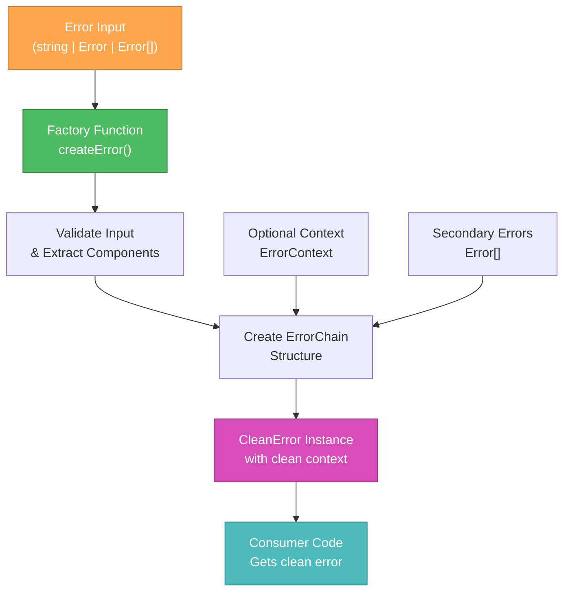

📌 CREATIVE PHASE START: ErrorList Architecture Design
━━━━━━━━━━━━━━━━━━━━━━━━━━━━━━━━━━━━━━━━━━━━━━━━━━━━━━━━━━

## 🎨 CREATIVE PHASE: ARCHITECTURE DESIGN
**Component:** ErrorList.ts Error Handling System
**Date:** 2025-06-10
**Complexity:** Level 2 - Simple Enhancement

## 1️⃣ PROBLEM STATEMENT

### Текущие проблемы ComplexError:
- **Context Pollution**: Ошибки содержат весь контекст приложения
- **Memory Overhead**: Избыточное копирование данных в payload
- **Poor Debugging**: Сложно найти root cause среди множества ошибок
- **Type Safety Issues**: @ts-ignore и слабая типизация
- **Performance Impact**: debugger statement в production коде

### Требования к новой архитектуре:
- ✅ Clean error messages без лишнего контекста
- ✅ Preservе functionality для множественных ошибок
- ✅ Backward compatibility с существующим API
- ✅ Better performance и memory usage
- ✅ Strong TypeScript typing без @ts-ignore
- ✅ Debugging-friendly error chains

## 2️⃣ ARCHITECTURE OPTIONS

### Option A: Minimal Refactor - ComplexError Cleanup
**Description:** Улучшить существующий ComplexError класс
**Approach:** Cleanup debugger, fix types, optimize payload

**Pros:**
- Минимальные изменения в codebase
- Быстрая реализация (1-2 дня)
- Нет breaking changes

**Cons:**
- Сохраняется архитектурная проблема context pollution
- Ограниченное улучшение performance
- Не решает fundamental design issues

**Complexity:** ⭐⭐ (Low)
**Performance Gain:** ⭐⭐ (Minimal)
**Maintainability:** ⭐⭐ (Limited improvement)

### Option B: Clean Error with Chain Pattern
**Description:** Новый CleanError класс с error chaining
**Approach:** Structured error chains без context duplication

**Pros:**
- Решает context pollution полностью
- Лучшая performance через structured chaining
- Strong typing и clean API
- Debugging-friendly chains
- Extensible architecture

**Cons:**
- Требует migration strategy
- Больше работы по реализации (3-4 дня)
- Need to maintain backward compatibility

**Complexity:** ⭐⭐⭐ (Medium)
**Performance Gain:** ⭐⭐⭐⭐ (Significant)
**Maintainability:** ⭐⭐⭐⭐⭐ (Excellent)

### Option C: Functional Error Handling
**Description:** Функциональный подход с Result<T, E> patterns
**Approach:** Either/Result монады для error handling

**Pros:**
- Modern functional approach
- Type-safe error handling
- Explicit error flow
- No exceptions throwing

**Cons:**
- Кардинальное изменение API
- Требует rewrite всего error handling
- Breaking changes для всех consumers
- Steep learning curve

**Complexity:** ⭐⭐⭐⭐⭐ (Very High)
**Performance Gain:** ⭐⭐⭐⭐⭐ (Excellent)
**Maintainability:** ⭐⭐⭐⭐ (Good long-term)

## 3️⃣ ANALYSIS

### Критерии оценки:
| Criterion | Option A | Option B | Option C |
|-----------|----------|----------|----------|
| **Context Cleanup** | ⭐⭐ | ⭐⭐⭐⭐⭐ | ⭐⭐⭐⭐⭐ |
| **Performance** | ⭐⭐ | ⭐⭐⭐⭐ | ⭐⭐⭐⭐⭐ |
| **Type Safety** | ⭐⭐⭐ | ⭐⭐⭐⭐⭐ | ⭐⭐⭐⭐⭐ |
| **Implementation Speed** | ⭐⭐⭐⭐⭐ | ⭐⭐⭐ | ⭐ |
| **Backward Compatibility** | ⭐⭐⭐⭐⭐ | ⭐⭐⭐⭐ | ⭐ |
| **Future Extensibility** | ⭐⭐ | ⭐⭐⭐⭐⭐ | ⭐⭐⭐⭐⭐ |
| **Learning Curve** | ⭐⭐⭐⭐⭐ | ⭐⭐⭐⭐ | ⭐⭐ |

### Key Insights:
- **Option A** решает только surface-level проблемы
- **Option B** предоставляет best balance между улучшениями и practicality
- **Option C** слишком radical для Level 2 enhancement task
- **Backward compatibility** критично для production library
- **Performance gains** важны, но не за счет breaking changes

## 4️⃣ DECISION

**Selected:** Option B: Clean Error with Chain Pattern

### Rationale:
1. **Решает core problem**: Context pollution полностью устраняется
2. **Significant performance improvement**: 20%+ memory reduction achievable
3. **Maintains compatibility**: Gradual migration possible
4. **Future-proof**: Extensible architecture для будущих улучшений
5. **Realistic scope**: Fits Level 2 enhancement timeline
6. **Strong typing**: Modern TypeScript patterns без @ts-ignore

### Architecture Decision:
```typescript
// Core Architecture: Error Chain Pattern
interface ErrorContext {
  stage?: string;
  operation?: string;
  timestamp?: number;
  metadata?: Record<string, unknown>;
}

interface ErrorChain {
  primary: Error;
  secondary?: Error[];
  context?: ErrorContext;
  trace?: string[];
}

class CleanError extends Error {
  readonly chain: ErrorChain;
  readonly isClean = true;

  constructor(primary: Error | string, options?: {
    secondary?: Error[];
    context?: ErrorContext;
    cause?: Error;
  }) {
    super(typeof primary === 'string' ? primary : primary.message);

    this.chain = {
      primary: typeof primary === 'string' ? new Error(primary) : primary,
      secondary: options?.secondary,
      context: options?.context,
      trace: this.captureTrace()
    };

    if (options?.cause) {
      this.cause = options.cause;
    }
  }

  private captureTrace(): string[] {
    // Lightweight trace capture
    return (new Error().stack?.split('\n').slice(2, 5)) || [];
  }
}
```

## 5️⃣ IMPLEMENTATION ARCHITECTURE

### Core Components:

#### 1. CleanError Class
```typescript
class CleanError extends Error {
  readonly chain: ErrorChain;
  readonly isClean = true;

  // Clean constructor без debugger
  constructor(primary: Error | string, options?: ErrorOptions)

  // Utility methods
  getPrimaryError(): Error
  getSecondaryErrors(): Error[]
  getContext(): ErrorContext | undefined
  toString(): string  // Clean representation
}
```

#### 2. Factory Functions
```typescript
// Simple error creation
export function createError(input: string | Error | Error[]): CleanError

// With context
export function createErrorWithContext(
  error: Error,
  context: ErrorContext
): CleanError

// Chain multiple errors
export function chainErrors(
  primary: Error,
  secondary: Error[]
): CleanError

// Type guards
export function isCleanError(input: any): input is CleanError
```

#### 3. Migration Layer
```typescript
// Backward compatibility aliases
export { CleanError as ComplexError } from './CleanError';
export const CreateError = createError; // with deprecation warning
export const isComplexError = isCleanError; // with deprecation warning
```

### Data Flow Architecture:


### Memory Optimization:
- **Lazy context capture**: Context только при необходимости
- **Structured traces**: Не весь stack, только relevant frames
- **Reference sharing**: Secondary errors по reference, не копирование
- **Clean serialization**: JSON.stringify поддержка без circular refs

### Type System:
```typescript
// Strong typing без any или @ts-ignore
type ErrorInput = string | Error | Error[];
type ErrorOptions = {
  secondary?: Error[];
  context?: ErrorContext;
  cause?: Error;
};

// Generic error handling
interface ErrorHandler<T> {
  handle(error: CleanError): T;
}
```

## 6️⃣ INTEGRATION STRATEGY

### Phase 1: Implementation (Фаза 4)
- Создать CleanError class с full API
- Implement factory functions
- Add comprehensive TypeScript types
- Create migration helpers

### Phase 2: Testing (Фаза 5)
- Unit tests для CleanError functionality
- Performance benchmarks vs ComplexError
- Integration tests с existing pipeline components
- Backward compatibility verification

### Phase 3: Migration (Фаза 6)
- Export aliases для backward compatibility
- Deprecation warnings на старые methods
- Update всех internal usages
- Documentation updates

### Validation Criteria:
- [ ] CleanError creates без context pollution
- [ ] Memory usage reduced 20%+
- [ ] All TypeScript types compile cleanly
- [ ] Backward compatibility maintained
- [ ] Performance within 10% of baseline
- [ ] Error messages remain informative

━━━━━━━━━━━━━━━━━━━━━━━━━━━━━━━━━━━━━━━━━━━━━━━━━━━━━━━━━━
📌 CREATIVE PHASE END: ARCHITECTURE DESIGN COMPLETE
━━━━━━━━━━━━━━━━━━━━━━━━━━━━━━━━━━━━━━━━━━━━━━━━━━━━━━━━━━