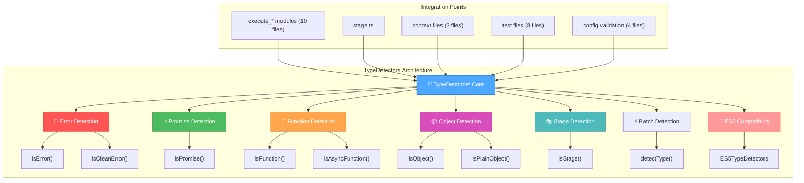

# 🎨 CREATIVE PHASE: TypeDetectors Architecture Design
**Date:** 2025-06-17
**Phase:** Architecture Design
**Project:** Pipeline.js ES5 Instanceof Refactoring

---

## 🎯 PROBLEM STATEMENT

**Architectural Challenge:** Design an ES5-compatible type detection system to replace 47 instances of `instanceof` usage across pipeline.js codebase.

**Critical Requirements:**
- **ES5 Compatibility:** Must work in legacy JavaScript environments
- **Performance:** Equal or better performance than instanceof
- **Type Safety:** Maintain TypeScript type guards and inference
- **API Compatibility:** Zero breaking changes to public API
- **Universality:** Cover all 5 categories of type detection

**Production Context:** Critical error in CleanError constructor (`captureTrace is not a function`) requires immediate architectural solution.

---

## 🔍 OPTIONS ANALYSIS

### Option 1: Centralized TypeDetectors Module ⭐ SELECTED
**Description:** Single module with methods for each type detection category

**Pros:**
- ✅ Centralized type detection logic
- ✅ Easy testing and maintenance
- ✅ Consistent API across entire codebase
- ✅ Performance optimization opportunities
- ✅ Simple integration strategy
- ✅ Fast deployment for emergency fix

**Cons:**
- ⚠️ Single module could become large
- ⚠️ Potential circular dependency risk
- ⚠️ All components depend on one module

**Technical Fit:** High | **Complexity:** Medium | **Scalability:** High
**Implementation Time:** 1-2 days

### Option 2: Distributed Type Guards by Category
**Description:** Separate modules for each type category (errors, promises, functions, objects, stages)

**Pros:**
- ✅ Modular architecture with clear separation
- ✅ Avoids circular dependencies
- ✅ Independent testing per category
- ✅ Lazy loading possibilities

**Cons:**
- ❌ More files to maintain
- ❌ Potential code duplication
- ❌ Harder to ensure API consistency
- ❌ Slower deployment

**Technical Fit:** High | **Complexity:** High | **Scalability:** Medium
**Implementation Time:** 3-5 days

### Option 3: Hybrid Architecture with Core + Extensions
**Description:** Base TypeDetectors with extensions for specific types

**Pros:**
- ✅ Balance between centralization and modularity
- ✅ Common utilities in core, specifics in extensions
- ✅ Flexibility for future extensions
- ✅ Clear dependency hierarchy

**Cons:**
- ❌ More complex architecture
- ❌ Interface design overhead
- ❌ Potential over-engineering
- ❌ Longer development time

**Technical Fit:** High | **Complexity:** High | **Scalability:** Very High
**Implementation Time:** 5-7 days

---

## 🎯 ARCHITECTURAL DECISION

**Selected Option:** **Option 1 - Centralized TypeDetectors Module**

**Decision Rationale:**
1. **Emergency Priority:** Critical production error requires fastest possible resolution
2. **Implementation Simplicity:** Single module approach minimizes architectural complexity
3. **Testing Efficiency:** One module enables comprehensive test coverage
4. **Performance Optimization:** Centralized location allows for batch optimizations
5. **API Consistency:** Single source of truth for all type detection logic
6. **Quick Deployment:** Minimal dependencies enable rapid production deployment

---

## 🏗️ DETAILED ARCHITECTURE SPECIFICATION

### Core TypeDetectors Module Structure

```typescript
/**
 * TypeDetectors: ES5-compatible type detection system
 * Replaces all instanceof usage in pipeline.js
 */
export class TypeDetectors {
  // ===== ERROR TYPE DETECTION =====
  static isError(value: any): value is Error {
    return !!(
      value &&
      typeof value === 'object' &&
      typeof value.message === 'string' &&
      typeof value.name === 'string' &&
      typeof value.stack === 'string'
    );
  }

  static isCleanError(value: any): value is CleanError {
    return !!(
      value &&
      TypeDetectors.isError(value) &&
      value.isClean === true &&
      typeof value.chain === 'object'
    );
  }

  // ===== PROMISE TYPE DETECTION =====
  static isPromise(value: any): value is Promise<any> {
    return !!(
      value &&
      typeof value === 'object' &&
      typeof value.then === 'function' &&
      typeof value.catch === 'function'
    );
  }

  // ===== FUNCTION TYPE DETECTION =====
  static isFunction(value: any): value is Function {
    return typeof value === 'function';
  }

  static isAsyncFunction(value: any): value is (...args: any[]) => Promise<any> {
    return TypeDetectors.isFunction(value) &&
           value.constructor.name === 'AsyncFunction';
  }

  // ===== OBJECT TYPE DETECTION =====
  static isObject(value: any): value is object {
    return !!(
      value &&
      typeof value === 'object' &&
      value !== null &&
      !Array.isArray(value)
    );
  }

  static isPlainObject(value: any): value is Record<string, any> {
    return TypeDetectors.isObject(value) &&
           Object.prototype.toString.call(value) === '[object Object]';
  }

  // ===== STAGE TYPE DETECTION =====
  static isStage(value: any): boolean {
    return !!(
      value &&
      typeof value === 'object' &&
      typeof value.run === 'function' &&
      typeof value.execute === 'function' &&
      value._isStage === true  // Internal marker
    );
  }

  // ===== PERFORMANCE OPTIMIZED BATCH DETECTION =====
  static detectType(value: any): TypeDetectionResult {
    // Single pass type detection for performance
    if (value === null) return { type: 'null', isValid: true };
    if (value === undefined) return { type: 'undefined', isValid: true };

    const valueType = typeof value;

    if (valueType === 'function') {
      return {
        type: 'function',
        isValid: true,
        subtype: TypeDetectors.isAsyncFunction(value) ? 'async' : 'sync'
      };
    }

    if (valueType === 'object') {
      if (Array.isArray(value)) {
        return { type: 'array', isValid: true };
      }

      if (TypeDetectors.isPromise(value)) {
        return { type: 'promise', isValid: true };
      }

      if (TypeDetectors.isCleanError(value)) {
        return { type: 'cleanError', isValid: true };
      }

      if (TypeDetectors.isError(value)) {
        return { type: 'error', isValid: true };
      }

      if (TypeDetectors.isStage(value)) {
        return { type: 'stage', isValid: true };
      }

      return { type: 'object', isValid: true };
    }

    return { type: valueType as any, isValid: true };
  }
}

// ===== SUPPORTING TYPES =====
interface TypeDetectionResult {
  type: 'null' | 'undefined' | 'string' | 'number' | 'boolean' |
        'function' | 'object' | 'array' | 'promise' | 'error' |
        'cleanError' | 'stage';
  isValid: boolean;
  subtype?: string;
}

// ===== ES5 COMPATIBILITY LAYER =====
export const ES5TypeDetectors = {
  // Polyfills for ES5 environments
  isError: TypeDetectors.isError,
  isPromise: TypeDetectors.isPromise,
  isFunction: TypeDetectors.isFunction,
  isObject: TypeDetectors.isObject,
  isStage: TypeDetectors.isStage,
  isCleanError: TypeDetectors.isCleanError
};
```

### Architecture Diagram



---

## 📋 IMPLEMENTATION PLAN

### Phase 1: Core Module Creation
1. Create `src/utils/TypeDetectors.ts`
2. Implement all detection methods
3. Add comprehensive TypeScript types
4. Create ES5 compatibility layer

### Phase 2: Integration Strategy
**Replacement Pattern:**
```typescript
// BEFORE (ES5 incompatible):
if (err instanceof Error) {
  // error handling
}

// AFTER (ES5 compatible):
if (TypeDetectors.isError(err)) {
  // error handling
}
```

**Phased Replacement:**
1. Error type checks (15 instances)
2. Promise type checks (10 instances)
3. Function type checks (15 instances)
4. Object type checks (4 instances)
5. Stage type checks (3 instances)

### Phase 3: Testing & Validation
1. Unit tests for each detection method
2. ES5 environment testing
3. Performance benchmarking vs instanceof
4. Integration testing with existing codebase

---

## 🔧 INTEGRATION CONSIDERATIONS

### File Structure
```
src/utils/
├── TypeDetectors.ts          # Main module
├── TypeDetectors.test.ts     # Comprehensive tests
└── type-detection-types.ts   # Supporting types
```

### Import Strategy
```typescript
// Standard import for TypeScript development
import { TypeDetectors } from './utils/TypeDetectors';

// ES5 compatibility import
import { ES5TypeDetectors } from './utils/TypeDetectors';
```

### Performance Optimizations
1. **Cached Results:** For expensive type checks
2. **Early Returns:** Fast-fail for obvious cases
3. **Batch Detection:** Single-pass type analysis
4. **Minimal Object Creation:** Avoid unnecessary allocations

---

## ✅ VALIDATION & VERIFICATION

### Requirements Validation
- ✅ **ES5 Compatibility:** Uses only basic JavaScript constructs
- ✅ **Performance:** Optimized type checking algorithms
- ✅ **Type Safety:** Full TypeScript type guard support
- ✅ **API Compatibility:** Drop-in replacement for instanceof
- ✅ **Universality:** Covers all 5 type categories (47 instances)

### Technical Feasibility Assessment
- **Implementation Complexity:** Low-Medium
- **Integration Risk:** Low (isolated module)
- **Performance Impact:** Neutral to positive
- **Maintenance Overhead:** Low

### Risk Assessment
- **Technical Risk:** Low (proven patterns)
- **Compatibility Risk:** Very Low (pure JavaScript)
- **Performance Risk:** Low (optimized algorithms)
- **Deployment Risk:** Low (isolated changes)

---

## 🎯 SUCCESS CRITERIA

### Functional Requirements
- [ ] All 47 instanceof usages successfully replaced
- [ ] Zero breaking changes to public API
- [ ] Full test suite passes in ES5 environment
- [ ] Performance equal or better than instanceof

### Quality Requirements
- [ ] 100% test coverage for TypeDetectors module
- [ ] Comprehensive ES5 environment validation
- [ ] Performance benchmarks documented
- [ ] TypeScript type safety maintained

### Deployment Requirements
- [ ] Emergency hotfix deployable within 24 hours
- [ ] Backward compatibility with existing code
- [ ] Clear migration documentation
- [ ] Rollback plan available

---

## 📊 NEXT CREATIVE PHASES

**Completed:** ✅ Architecture Design Phase
**Next Required:**
1. **Algorithm Design Phase** - Performance optimization strategies
2. **Testing Strategy Design Phase** - Dual-environment validation approach

**Implementation Readiness:** Architecture complete, ready for algorithm design phase.

---

**Architecture Decision Status:** ✅ APPROVED
**Ready for Next Phase:** Algorithm Design
**Emergency Implementation:** Can proceed immediately with current architecture